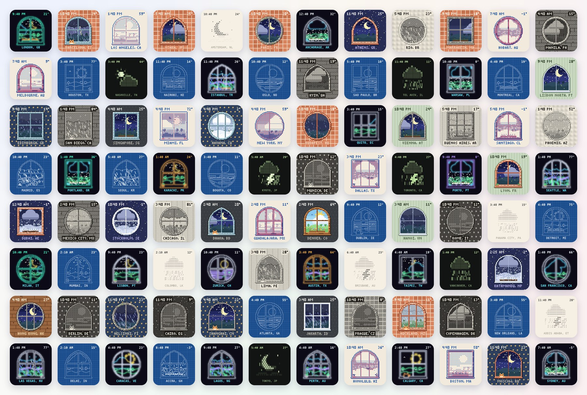
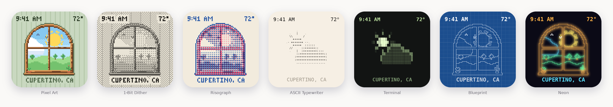
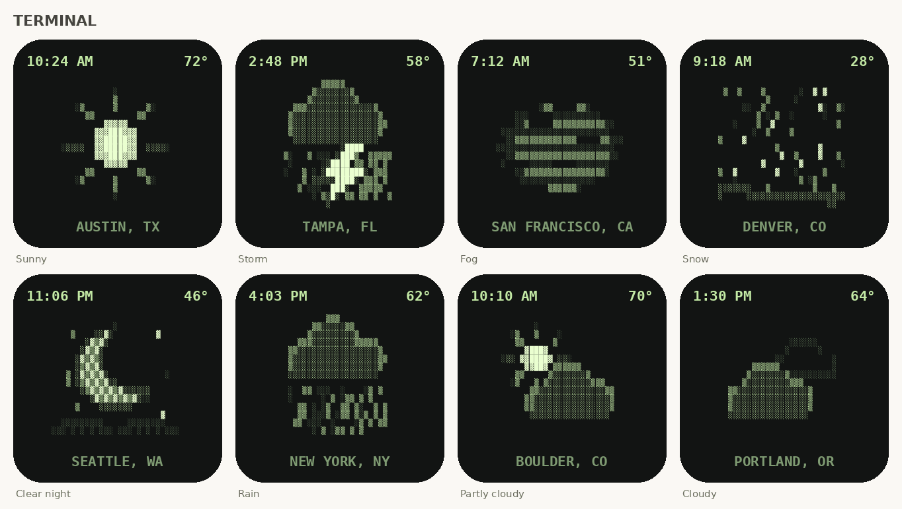
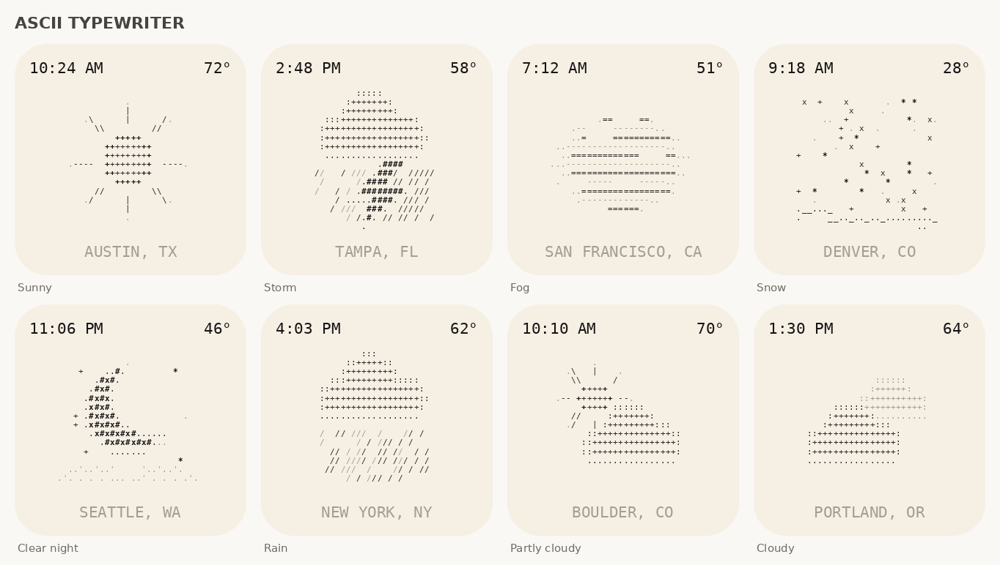
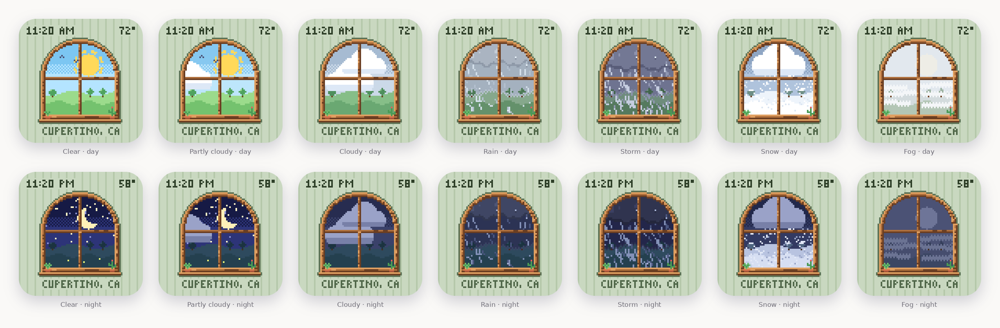
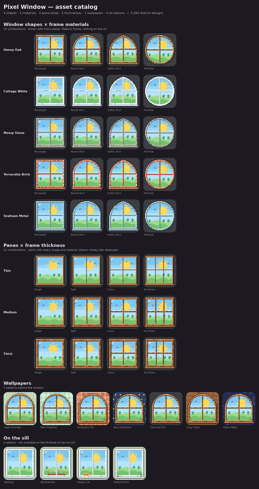
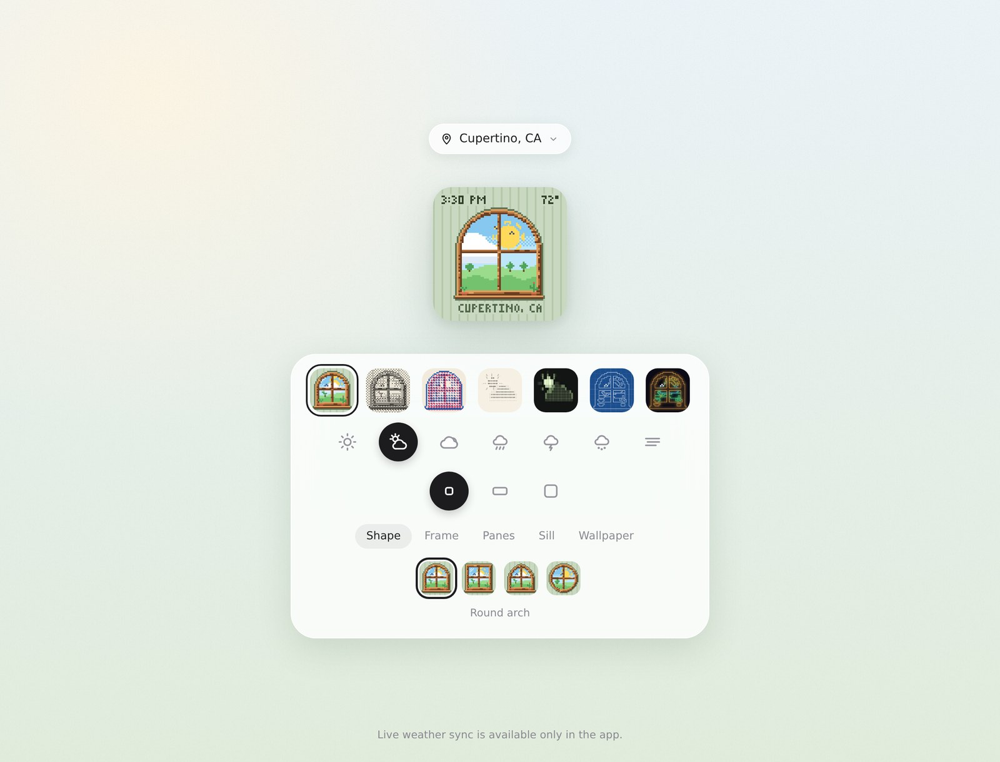

# 🪟 Pixel Window

**A tiny window on your Home Screen that shows today's sky.** 
A weather widget for iPhone, drawn pixel by pixel, in seven looks.

[**▶ Try the live demo**](https://jkhang9.github.io/Widget-Demo/) 
 

[**▶ App Store**]&nbsp;·&nbsp; iOS 17+ &nbsp;·&nbsp; SwiftUI + WidgetKit 

 

 

## ✨ What it does

- 🌦️ **Real weather, really drawn**: sun, clouds, rain, storms, snow and fog, each animated a frame per minute.
- 🌙 **Knows when it's night**: the moon comes out when the sun sets wherever you are.
- 🕰️ **Time, temperature and place**: the time and temperature up top, your city along the bottom.
- 🎨 **Seven looks**: Pixel Art, 1-Bit Dither, Risograph, ASCII Typewriter, Terminal, Blueprint and Neon.
- 🏠 **Your window, your way**: pick the shape, frame, panes, wallpaper, and who's sitting on the sill.
- 📐 **Every size**: Lock Screen (round and rectangular) plus small, medium and large Home Screen widgets.

 

## 🎨 Seven looks

ASCII Typewriter and Terminal skip the window and draw just the weather, in characters:

  
  

 

## 🌦️ Every kind of weather, day and night

Little details follow the weather: the window box loses its flowers in the snow, raindrops slide down the glass, frost creeps into the corners, and the cat wakes up when it thunders. ⚡🐈

 

## 🏠 Build your window

| | Options |
|---|---|
| **Shape** | Rectangle · Round Arch · Gothic Arch · Porthole |
| **Frame** | Honey Oak · Cottage White · Mossy Stone · Terracotta Brick · Seafoam Metal, in thin, medium or thick |
| **Panes** | Single · Split · Cross · Six panes |
| **On the sill** | Nothing · Window Box · Sleepy Cat · Potted Plants |
| **Wallpaper** | Sage Pinstripe · Mint Gingham · Terracotta Tile · Navy Diamond · Charcoal Dot · Cozy Cabin · Starry Night |

That's **240 windows** and **5,460 complete designs**, before you count the weather.

 

## 🖱️ The web demo

Try every look, weather, size and window option right in the browser. Search any of ~34,000 cities to see its real local time, and the widget switches to its night look after sunset there. The demo uses sample weather; live weather sync is in the app.

 

## 🙏 Credits

- Weather by [Open-Meteo](https://open-meteo.com) (free, no API key needed).
- City names and timezones from [GeoNames](https://www.geonames.org), [CC BY 4.0](https://creativecommons.org/licenses/by/4.0/), via [geonamescache](https://github.com/yaph/geonamescache).
- Labels in [IBM Plex Mono](https://github.com/IBM/plex) for the Blueprint and Neon looks.

 
made with tiny squares and a lot of weather 🌤️

